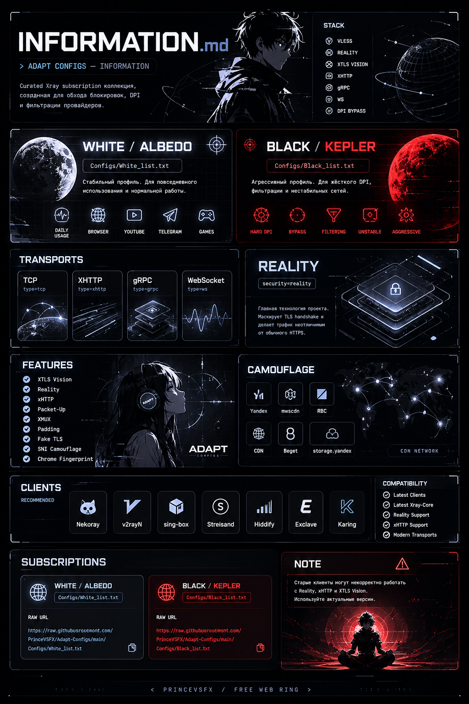

<div align="center">



</br>


  


</div>

</br>

### Навигация

| Раздел                                                                            | Описание                        |
| --------------------------------------------------------------------------------- | ------------------------------- |
| [Принципы Конфигов](#принципы-конфигов)                                        | Основные принципы проекта       |
| [Характеристики](#характеристики)                                              | BLACK / KEPLER и WHITE / ALBEDO |
| [Отличия](#отличия)                                                            | Сравнение технологий            |
| [VLESS + Reality](#vless--reality)                                             | Современный анти-DPI стек       |
| [SOCKS5](#socks5)                                                               | Классический прокси             |
| [Hysteria2](#hysteria2)                                                        | QUIC / HTTP3 решение            |
| [Trojan](#trojan)                                                              | HTTPS-маскировка                |
| [Что выбрать?](#что-выбрать)                                                   | Рекомендации по выбору          |
| [Теги репозитория](#теги-репозитория)                                         | Ключевые технологии             |
| [License](https://github.com/PrinceVSFX/Adapt-Configs/blob/main/LICENSE)       | Лицензия проекта                |
| [Disclaimer](https://github.com/PrinceVSFX/Adapt-Configs/blob/main/DISCLAIMER) | Отказ от ответственности        |


### Принципы Конфигов

```txt
[✓] СТАБИЛЬНОСТЬ
[✓] МИНИМАЛИЗМ
[✓] МАСКИРОВКА
[✓] СОВМЕСТИМОСТЬ

[✓] REALITY
[✓] XTLS VISION
[✓] XHTTP
[✓] DPI BYPASS

[✗] ЛИШНИЕ НАСТРОЙКИ
[✗] УСТАРЕВШИЕ РЕШЕНИЯ
[✗] ПЕРЕГРУЖЕННЫЕ КОНФИГИ
[✗] МАРКЕТИНГОВЫЙ ШУМ
```

### Характеристики

**BLACK / KEPLER**

```yaml
ПРОФИЛЬ: Агрессивный

ОСНОВА:
  - xHTTP
  - Reality

ПРЕДНАЗНАЧЕНИЕ:
  - Жёсткий DPI
  - Фильтрация провайдера
  - Ограниченные сети
  - Сложные условия подключения

ЗАДЕРЖКА: СРЕДНЯЯ
НАГРУЗКА: СРЕДНЯЯ
МАСКИРОВКА: УСИЛЕННАЯ

XMUX: ВКЛЮЧЁН
PACKET MASKING: ВКЛЮЧЁН

СТАБИЛЬНОСТЬ: ВЫСОКАЯ
``` 

**WHITE / ALBEDO**

```yaml
ПРОФИЛЬ: Стабильный

ОСНОВА:
  - Reality
  - XTLS Vision

ПРЕДНАЗНАЧЕНИЕ:
  - Браузер
  - YouTube
  - Telegram
  - Discord
  - Игры

ЗАДЕРЖКА: НИЗКАЯ
НАГРУЗКА: НИЗКАЯ
МАСКИРОВКА: СТАНДАРТНАЯ

СТАБИЛЬНОСТЬ: ВЫСОКАЯ
```

</br>

### Отличия

- **VLESS + REALITY** — современное решение для обхода DPI, использующее VLESS и технологию REALITY для имитации реального HTTPS-трафика. Не требует собственного TLS-сертификата и обеспечивает высокий уровень маскировки.

- **SOCKS5** — универсальный прокси-протокол для передачи TCP и UDP трафика. Не шифрует данные самостоятельно и не предназначен для обхода современных систем DPI.

- **Hysteria2** — высокопроизводительный протокол на базе QUIC (UDP), оптимизированный для нестабильных сетей, высокой задержки и потери пакетов. Маскируется под HTTP/3-трафик.

- **Trojan** — прокси-протокол, использующий стандартный TLS для маскировки под обычный HTTPS-трафик. Обычно требует собственный домен и TLS-сертификат.

### Vless + Reality

**Что такое VLESS?**

***Vless*** *— современный прокси-протокол из экосистемы Xray, разработанный как более лёгкая и производительная альтернатива VMess. В отличие от VMess, VLESS не использует собственное шифрование трафика и полагается на TLS, что уменьшает количество распознаваемых сигнатур и делает соединение менее заметным для систем анализа трафика.*

**Что такое Reality?**

***Realty*** *— технология маскировки в Xray, позволяющая устанавливать TLS-соединения без собственного сертификата и домена. Вместо этого соединение имитирует обращение к реальному популярному HTTPS-сайту.*

*Для стороннего наблюдателя трафик выглядит как обычное HTTPS-соединение, что значительно усложняет его обнаружение и фильтрацию.*

**Преимущества Vless + Reality**

- Высокая устойчивость к DPI (Deep Packet Inspection).
- Минимальное количество уникальных сигнатур.
- Отсутствие необходимости выпускать TLS-сертификаты.
- Маскировка под обычный HTTPS-трафик.
- Высокая производительность и низкие накладные расходы.
- Простая настройка по сравнению с классическими TLS-конфигурациями.

**Как это работает?**

```text
Client ➔ VLESS ➔ REALITY ➔ TCP ➔ Internet
```

### SOCKS5

**Что такое SOCKS5?**

***SOCKS5 (Socket Secure версии 5)*** *— это сетевой прокси-протокол, предназначенный для пересылки трафика между клиентом и удалённым сервером. В отличие от VPN, SOCKS5 не создаёт зашифрованный туннель и не изменяет сетевой стек операционной системы.*

*Протокол работает на уровне приложений и позволяет передавать TCP- и UDP-трафик через промежуточный сервер.*

**Преимущества SOCKS5**

- Высокая скорость работы.
- Низкие накладные расходы.
- Поддержка TCP и UDP.
- Простота настройки.
- Совместимость с большим количеством приложений.

**Недостатки**

- Не шифрует трафик самостоятельно.
- Не обеспечивает защиту данных без дополнительных механизмов.
- Не скрывает факт использования прокси.
- Требует поддержки SOCKS5 со стороны приложения.

**Как это работает?**

```text
Application ➔ SOCKS5 Proxy ➔ Destination Server
```

**Когда использовать?**

SOCKS5 подходит для:

- браузеров;
- торрент-клиентов;
- игровых приложений;
- разработки и тестирования;
- выборочного перенаправления трафика.

**Безопасность**

*Сам по себе SOCKS5 не обеспечивает шифрование. Для защиты соединения рекомендуется использовать его совместно с TLS, Shadowsocks или другими механизмами шифрования.*

### Hysteria2

**Что такое Hysteria2?**

***Hysteria2*** *— современный прокси-протокол, ориентированный на работу в сетях с активной фильтрацией и ограничениями. В качестве транспортного уровня использует QUIC, работающий поверх UDP.*

*Основная цель Hysteria2 — обеспечить высокую скорость соединения, устойчивость к потерям пакетов и усложнить обнаружение трафика системами DPI.*

**Особенности**

- Использует QUIC вместо TCP.
- Поддерживает мультиплексирование соединений.
- Хорошо работает в сетях с высокой задержкой.
- Маскируется под обычный HTTP/3-трафик.
- Оптимизирован для нестабильных сетей.

**Преимущества**

- Высокая скорость передачи данных.
- Низкая задержка.
- Быстрое восстановление соединения.
- Эффективное использование каналов связи.
- Хорошая устойчивость к сетевым помехам.

**Как это работает?**

```text
Client ➔ Hysteria2 ➔ QUIC UDP Internet
```

**Когда использовать?**

Hysteria2 рекомендуется использовать:

- в сетях с высокой потерей пакетов;
- для потокового видео;
- для онлайн-игр;
- в условиях активного DPI;
- когда важна максимальная производительность.

**Ограничения**

*Некоторые провайдеры могут ограничивать или блокировать нестандартный QUIC-трафик. В таких сетях эффективность Hysteria2 может снижаться.*

**Безопасность**

*Hysteria2 использует современные криптографические механизмы и защищённые транспортные соединения на базе QUIC.*

### Trojan

**Что такое Trojan?**

***Trojan*** *— прокси-протокол, разработанный для маскировки трафика под обычное HTTPS-соединение. В отличие от многих других решений, Trojan использует стандартный TLS без собственных уникальных механизмов рукопожатия.*

*Главная идея Trojan заключается в том, чтобы выглядеть максимально похоже на легитимный HTTPS-трафик.*

**Особенности**

- Использует стандартный TLS.
- Не имеет характерных сигнатур VPN-протоколов.
- Маскируется под обычный веб-трафик.
- Поддерживает TCP и различные транспорты.
- Простая архитектура.

**Преимущества**

- Высокая совместимость.
- Простота развёртывания.
- Хорошая устойчивость к DPI.
- Использование стандартных HTTPS-механизмов.
- Поддержка популярных клиентов и серверов.

**Как это работает?**

```text
Client ➔ Trojan ➔ TLS ➔ TCP ➔ Internet
```

**Когда использовать?**

Trojan подходит для:

- обхода сетевых ограничений;
- маскировки трафика под HTTPS;
- корпоративных и домашних серверов;
- сетей с умеренным DPI-контролем.

**Безопасность**

*Trojan использует стандартный TLS и наследует его уровень безопасности. Для максимальной защиты рекомендуется использовать современные версии TLS и регулярно обновлять программное обеспечение сервера.*

### Что выбрать?

Выбор зависит от ваших задач:

- **VLESS + REALITY** — лучший универсальный вариант для большинства пользователей. Обеспечивает хорошую скорость, высокий уровень маскировки и устойчивость к DPI. Рекомендуется как основная конфигурация.

- **Hysteria2** — стоит выбирать, если приоритетом являются максимальная скорость, низкая задержка и работа в нестабильных сетях. Особенно хорошо подходит для стриминга, игр и мобильных сетей.

- **Trojan** — хороший вариант, если нужен трафик, максимально похожий на обычный HTTPS. Подходит для классических серверных конфигураций с собственным доменом и TLS-сертификатом.

- **SOCKS5** — подходит для проксирования отдельных приложений и сервисов, но не является полноценной заменой современным решениям для обхода DPI.

***Для большинства сценариев рекомендуется **VLESS + REALITY**. Если требуется максимальная производительность и сеть не ограничивает UDP-трафик — рассмотрите **Hysteria2**.***

</br>

#### Теги репозитория

<div align="center">


</div>

</br>

<div align="center">

<a href="https://github.com/PrinceVSFX/Adapt-Configs/blob/main/LICENSE">
  
</a>

<a href="https://github.com/PrinceVSFX/Adapt-Configs/blob/main/DISCLAIMER">
  
</a>

</div>
