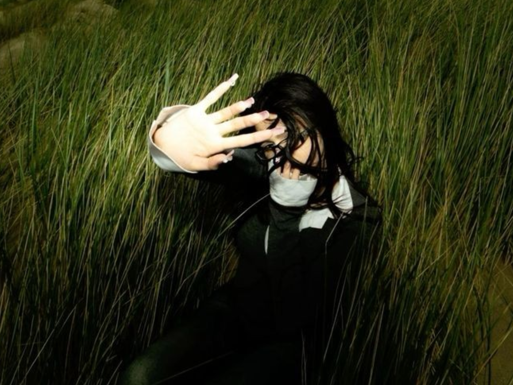
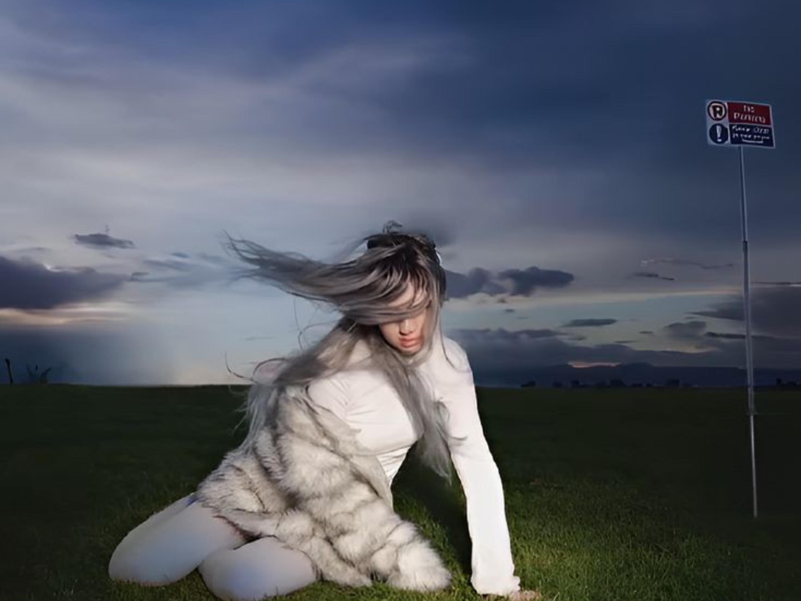
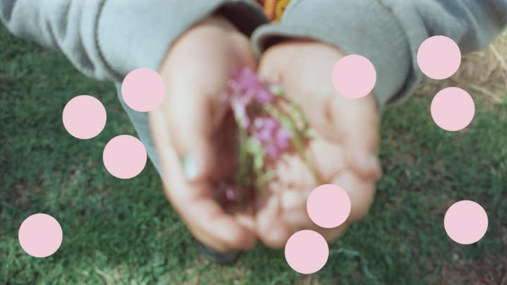

CONFIGS × ИНФОРМАЦИЯ

 

| | |
|:-:|:-:|
|  |  |
| **⚫ BLACK / KEPLER** | **⚪ WHITE / ALBEDO** |
| Базовый канал. Работает всегда. <a href="https://raw.githubusercontent.com/PrinceVSFX/Adapt-Configs/main/Configs/Black_list.txt">📄 Black_list.txt (RAW)</a> | Отражает блокировки. Когда Black не справляется. <a href="https://raw.githubusercontent.com/PrinceVSFX/Adapt-Configs/main/Configs/White_list.txt">📄 White_list.txt (RAW)</a> |

 

