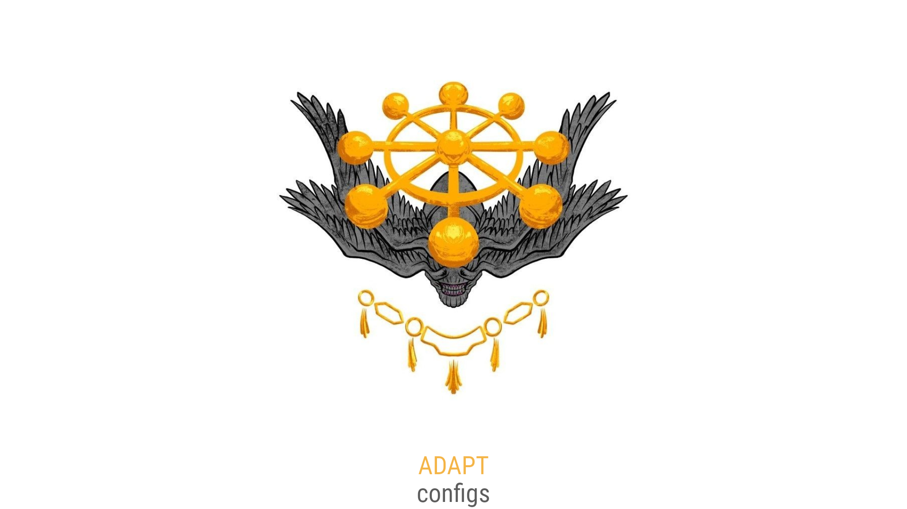

  <a href="#-русский">🇷🇺 RU</a> | 
  <a href="#-english">🇬🇧 EN</a>

 

Добро пожаловать! Здесь вы найдёте готовые конфигурации для быстрого и стабильного подключения.

## 🔐 Конфиги

### 1. Black — Основной список. Ключи: Kepler
> Представьте себе мир, где нет «запертых дверей». Где информация течёт свободно. Именно так выглядит экзопланета Kepler-452b — «старший брат» Земли. Наш список Main работает по тому же принципу. Это ваш базовый, надёжный канал, созданный для обхода блокировок. С ним вы всегда на связи, независимо от внешних условий.

### 2. White — Белый список. Ключи: Albedo
> Слышали про альбедо? Это физическая величина, которая показывает, сколько света отражает поверхность. У свежего снега альбедо близко к 100%. Наш список Albedo — это квинтэссенция белого цвета. Он не просто обходит ограничения, он «отражает» их, проходя сквозь белые списки там, где обычные ключи бессильны.

### 🎯 Что выбрать для подключения?

| Список | Ключи | Когда использовать |
|--------|-------|-------------------|
| **Black (Kepler)** | `Kepler` | Основное, повседневное решение |
| **White (Albedo)** | `Albedo` | Когда Kepler не справляется или нужен максимальный обход |

Сохраняйте оба списка и будьте всегда на связи! ☀️

### 📁 Ссылки на конфиги

- **Black (Kepler):** [Main_list.txt](https://raw.githubusercontent.com/PrinceVSFX/V2Ray-Configs/main/Main_list.txt)
- **White (Albedo):** [White_list.txt](https://raw.githubusercontent.com/PrinceVSFX/V2Ray-Configs/main/White_list.txt)

## 📱 Рекомендуемые приложения

### ⚡ Hiddify — Универсальный клиент (рекомендован)
Поддерживает **Android, iOS, Windows, macOS, Linux**.

**Протоколы:** VLESS, VMess, Reality, TUIC, Hysteria2, Trojan, SSH, Shadowsocks.
**Особенности:** Автовыбор быстрого узла, отображение трафика, импорт ссылок в один клик, без рекламы.

### 📋 Полный список по платформам

| Платформа | Приложение | Протоколы |
|-----------|-----------|-----------|
| **Android** | v2rayNG | Xray, v2fly core |
| | Exclave | VLESS, VMess, Trojan, Shadowsocks |
| **iOS** | Happ | VLESS, Reality, VMess, Trojan, SS, Hysteria2 |
| | Alice Ray | VLESS, VMESS, SS, Trojan |
| **macOS** | V2Ray Client+ | VLESS Reality, XTLS |
| | Throne | VLESS, Trojan, Hysteria2, Wireguard |
| **Windows** | Throne | Все основные протоколы + SOCKS |
| | v2rayN | Shadowsocks, VLESS, VMess |

## 🚀 Быстрый старт

1.  **Скачайте подходящее приложение** из списка выше.
2.  **Скопируйте ссылку** на конфиг (Black или White).
3.  **Импортируйте** её в приложение (обычно через ➕ или "Import from Clipboard").
4.  **Подключитесь** и наслаждайтесь свободным интернетом.

## ⚠️ Важно
- Не используйте конфиги для незаконной деятельности.
- Сохраните оба списка, чтобы всегда иметь запасной вариант.

### 🌟 Звёздочка проекту
Если конфиги помогли, поставь ⭐ вверху страницы! Это мотивирует обновлять списки.
